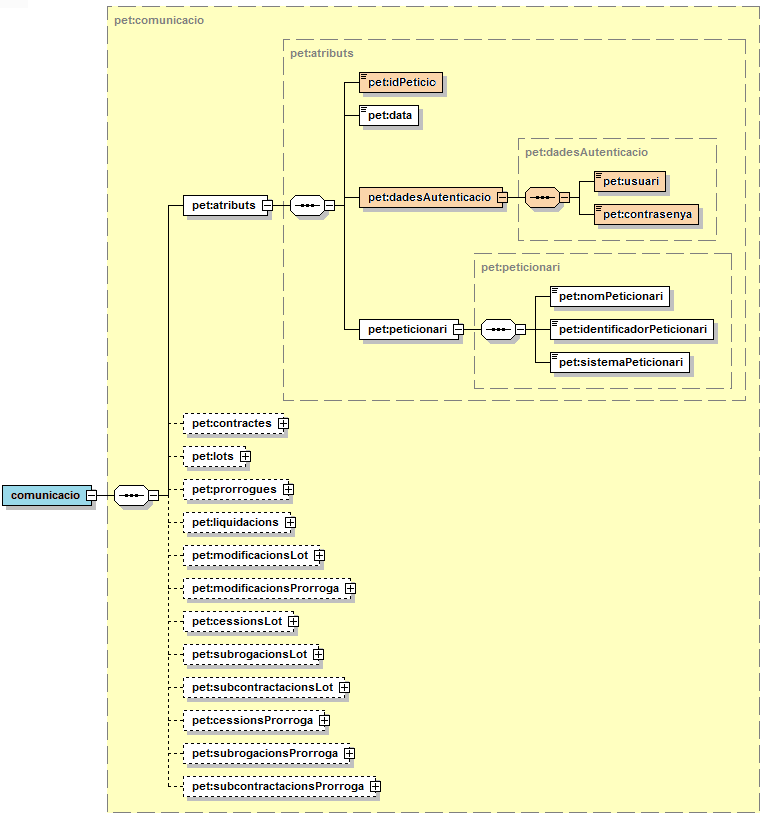
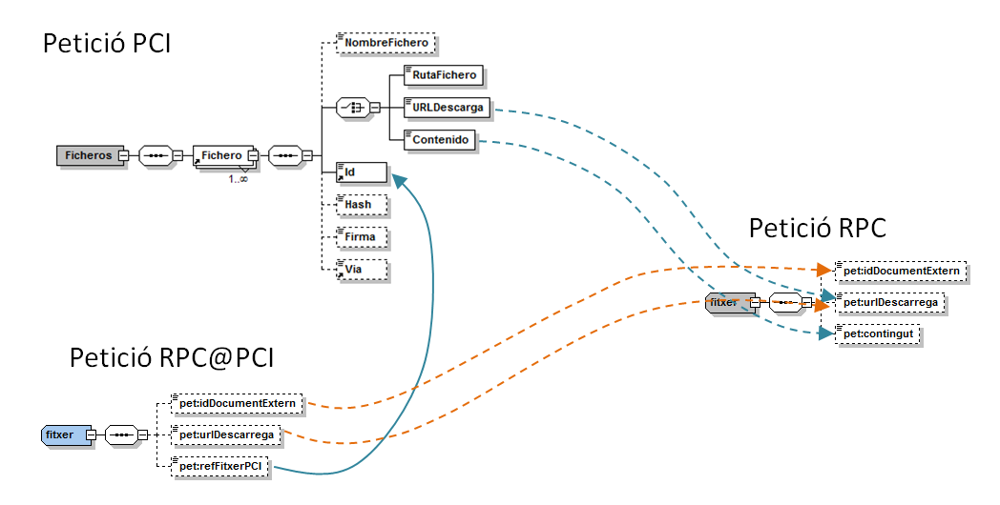
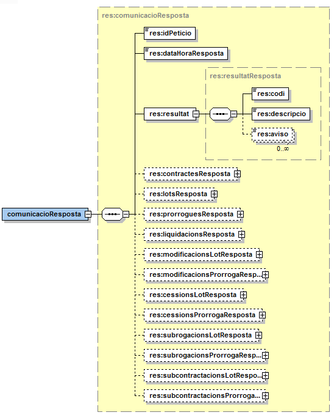

# RPC - Registre Públic de Contractes de la Generalitat (integració via PCI)**

# **Document d&#39;integració del servei**

**Històric de revisions**

| **Versió** | **Data** | **Autor** | **Comentaris** |
| --- | --- | --- | --- |
| V1.0 | 01/03/2017 | Òscar Trapote | Creació del document |

# 1 Introducció

Aquest document detalla els aspectes a tenir en compte al realitzar la integració amb els serveis oferts pel RPC (Registre Públic de Contractes) a través de la plataforma PCI.

Per poder realitzar la integració cal conèixer prèviament la següent documentació:

- [Document de Missatgeria Genèrica de la PCI del Consorci AOC.][PCI]
- [Document d&#39;Integració del servei RPC del Departament d&#39;Economia.][RPC]

[PCI]:https://github.com/ConsorciAOC/PCI
[RPC]:https://github.com/ConsorciAOC/RPC/tree/main/Manual%20d%E2%80%99integraci%C3%B3%20RPC


# 2 Transmissions de dades disponibles

Les dades disponibles a través del servei són les que es presenten a continuació:

| **EMISSOR** |
| --- |
| Consorci Administració Oberta Catalunya |

| **PRODUCTE (CodigoProducto)** |**MODALITAT (CodigoCertificado)** | **DESCRIPCIO** |
| --- | --- | --- |
| **RPC** | RPC | Aquesta modalitat ofereix una única operació o modalitat de consum, ja que la missatgeria especifica permet, variant la construcció del missatge, canviar la semàntica de la operació.<br>La missatgeria emprada es la mateixa que la del servei RPC, amb algunes variacions que es recullen en el present document. |

**(Correspondència amb missatgeria PCI)**


**FINALITATS**


| **MODALITAT** | **PREPRODUCCIÓ** | **PRODUCCIÓ** |
| --- | --- | --- |
| RPC | PROVES | - |


# 3 Missatgeria dels serveis

La missatgeria del la modalitat de consum segueix la especificació de la missatgeria recollida al document [RPC-Manual_integradors_ws_serveisRPC-v3.4.pdf][RPC] proporcionat pel equip de suport a la integració del servei RPC del Departament d&#39;Economia. Aquest document haurà de ser consultat per a conèixer gramàtica i codificació dels camps a l&#39;hora de construir les peticions.

A continuació es documenten les variacions que s&#39;han introduït respecte a la missatgeria del servei esmentat per adaptar-la a l&#39;àmbit de la PCI.

## 3.1 Missatgeria especifica RPC@PCI vs RPC@RPC

Tot i que s&#39;ha emprat com a base la missatgeria del servei RPC, s&#39;ha creat una versió &quot;còpia&quot; d&#39;aquesta per a poder introduir variacions allà a on es pot aprofitar elements de la PCI per a abstraure els integradors d&#39;aspectes repetitius o tècnicament feixucs de la integració amb el sistema RPC.

Els namespaces de la missatgeria del servei son els següents:

PETICIO http://cat.aoc/rpc/peticion

RESPOSTA http://cat.aoc/rpc/respuesta

### 3.1.1 Petició – dades específiques

La estructura del missatge es mostra a la següent il.lustració:



En el gràfic s&#39;ha pintat tres elements amb color **rosat**. Aquests elements no han de ser informats normalment, ja que PCI informarà uns valors per defecte que seran vàlids en la pràctica totalitat dels casos.

La missatgeria manté aquests camps per a que un integrador els pugui informar si és necessari, sobreescribint els valors que el servei enviarà per defecte.

Describim a la següent taula el seu significat i com es tracten al servei:

| _Element_ | _Descripció_ |
| --- | --- |
| /comunicacio/atributs/idPeticio | Identificador únic de la petició. Aquest camp s&#39;informarà automàticament amb el valor del camp IdPeticion a la petició genèrica de la PCI (/Peticion/Atributos/IdPeticion).<br><br>En el cas que aquest comportament no fos adient, sempre es pot informar el valor desitjat en aquest camp i serà aquest el que es traslladarà al RPC. |
| /comunicacio/atributs/dadesAutenticacio/usuari | Credencials (nom d&#39;usuari) a emprar en la invocació al servei RPC.<br><br>Per defecte s&#39;usaran les credencials que han estat assignades al Consorci AOC pel RPC i que tenen privilegis suficients per a registrar contractes dins de l&#39;espai d&#39;altres organismes.<br><br>Arribat el cas en que un integrador necessités informar les seves pròpies credencials, les podrà posar a aquest camp i seran traslladades a la crida corresponent cap al RPC en contes de les establertes per defecte. |
| /comunicacio/atributs/dadesAutenticacio/contrasenya | Credencials (constrasenya) a emprar en la invocació al servei RPC.<br><br>Per defecte s&#39;usaran les credencials que han estat assignades al Consorci AOC pel RPC i que tenen privilegis suficients per a registrar contractes en representació d&#39;altres organismes.<br><br>Arribat el cas en que un integrador necessités informar les seves pròpies credencials, les podrà posar a aquest camp i seran traslladades a la crida corresponent cap al RPC en contes de les establertes per defecte. |

Altres camps rellevants que sí han de ser informats pel integrador es descriuen a la següent taula:

| _Element_ | _Descripció_ |
| --- | --- |
| /comunicacio/atributs/peticionari/nomPeticionari | Nom de l&#39;usuari de la aplicació que origina la petició. |
| /comunicacio/atributs/peticionari/identificadorPeticionari | Identificador de l&#39;usuari que realitza la petició o la persona responsable. |
| /comunicacio/atributs/peticionari/sistemaPeticionari | Identificador de la aplicació o sistema que origina la petició, com per exemple GEEC, TEEC, DESAL, ....<br><br>Aquest identificador ha d&#39;existir a la base de dades del RPC, pel que s&#39;haurà de contactar amb l&#39;equip de suport de RPC per a fer aquesta gestió. |

### 3.1.2 Petició – enviament de documents

A la versió 3.4 del servei RPC s&#39;ofereixen tres mecanismes per a fer arribar la documentació adjunta:

1. **Identificador de document** : A la petició es dona un identificador únic del document que posteriorment RPC usarà per a estirar el document des del gestor documental o repositori de l&#39;organisme.<br><br>L&#39;us d&#39;aquest mecanisme implica que RPC ha de tenir a la seva base de dades tota la informació relativa al gestor documental de l&#39;organisme, URLs i credencials d&#39;accés si s&#39;escau. Aquesta gestió s&#39;ha de realitzar directament amb l&#39;equip de suport del servei RPC.<br><br>
2. **URL de descàrrega** : A la petició s&#39;informa la URL de descàrrega del document que posteriorment RPC usarà per a estirar-ne el contingut. Aquesta URL ha de ser forçosament HTTPS, és a dir, ha d&#39;usar connexió xifrada.<br><br>
3. **Contingut del fitxer** : RPC permet traslladar directament el contingut del document junt amb la petició WebService, usant optimització MTOM+XOP. PCI no suporta adjuntar contingut binari a punts arbitraris del missatge de petició, però aquesta optimització es pot aprofitar usant el bloc &quot;Ficheros&quot; de la missatgeria genèrica de la PCI.

Per a aquest fi es posa a disposició dels integradors el bloc &#39;_fitxer_&#39;, que conté els següents camps:

| _Element_ | _Descripció_ |
| --- | --- |
| idDocumentExtern | Nom de l&#39;usuari de la aplicació que origina la petició, en el cas que aquesta es produeixi per intervenció humana. |
| urlDescarrega | Identificador de l&#39;usuari que realitza la petició o la persona responsable. |
| refFitxerPCI | Apuntador cap al bloc &#39;Fichero&#39; de la petició genèrica PCI que conté les dades del document.<br><br>En el moment de realitzar la petició cap a RPC s&#39;inclourà el contingut del document o la URL de descàrrega si ha estat informada. |

La transformació que es realitza internament es mostra al següent gràfic:



Com es pot veure a la il·lustració, es poden donar dos grans casos:

- **Fletxes taronja**: S&#39;informen els camps &#39;idDocumentExtern&#39; o &#39;urlDescarrega&#39; a la petició específica, que es traslladaran directament cap a la petició al servei RPC.
- **Fletxes verdes**: S&#39;informa un identificador de fitxer al camp &#39;refFitxerPCI&#39;, pel que es busca a la petició genèrica de la PCI un bloc &#39;Fichero&#39; amb aquest identificador i es traslladen a la petició al servei RPC les dades disponibles, que poden ser, o bé la &#39;URLDescarga&#39;, o bé el contingut del fitxer, obtingut dels camps &#39;Contenido&#39; o &#39;RutaFichero&#39;. Aquesta casuística permet fer arribar la documentació a RPC directament invocant la PCI aprofitant la optimització MTOM+XOP.

La resta de la missatgeria de petició es descriu de manera detallada a la guia d&#39;integració del servei RPC del Departament d&#39;Economia de la Generalitat de Catalunya, secció 4.1, pàgina 12.

### 3.1.3 Resposta – dades específiques

La resposta del servei RPC@PCI és idèntica a la del servei RPC@RPC



El namespace del missatge de resposta, però, sí que canvia per a ser congruent amb el missatge de petició. Així doncs, recordem que el missatge de resposta té el següent namespace:

http://cat.aoc/rpc/resposta

Per a una descripció detallada de la missatgeria de resposta, consulteu la guia d&#39;integració del servei RPC del Departament d&#39;Economia de la Generalitat de Catalunya, secció 4.2, pàgina 68.

# ANNEX 1 – Guia d&#39;integració del servei RPC

A continuació trobareu [la guia d&#39;integració del servei RPC per a la versió sobre la que s&#39;ha desenvolupat aquesta modalitat de consum.][RPC]


# ANNEX 2 – Exemples de petició

Recomanem la consulta del darrer fitxer de proves de en format soap-ui, on hi haurà plasmats exemples representatius:

A continuació es presenta un dels exemples que es recullen al projecte SOAPUI

```
<soapenv:Envelope xmlns:soapenv="http://schemas.xmlsoap.org/soap/envelope/">
	<soapenv:Header/>
	<soapenv:Body>
		<open:procesa xmlns:open="http://www.openuri.org/">
			<pet:Peticion xmlns:pet="http://gencat.net/scsp/esquemes/peticion">
				<pet:Atributos>
					<pet:IdPeticion>SP001-PRE-000000000000000P</pet:IdPeticion>
					<pet:NumElementos>1</pet:NumElementos>
					<pet:TimeStamp>02-03-2017T10:00:00+01:00</pet:TimeStamp>
					<pet:CodigoCertificado>RPC</pet:CodigoCertificado>
					<pet:CodigoProducto>RPC</pet:CodigoProducto>
					<pet:DatosAutorizacion>
						<pet:IdentificadorSolicitante>0000000000</pet:IdentificadorSolicitante>
						<pet:NombreSolicitante>Nombre Solicitante</pet:NombreSolicitante>
						<pet:Finalidad>TEST</pet:Finalidad>
					</pet:DatosAutorizacion>
					<pet:Emisor>
						<pet:NifEmisor>Nif Emisor</pet:NifEmisor>
						<pet:NombreEmisor>Nombre Emisor</pet:NombreEmisor>
					</pet:Emisor>
					<pet:IdSolicitanteOriginal>0000000000</pet:IdSolicitanteOriginal>
					<pet:NomSolicitanteOriginal>Nombre Solicitante</pet:NomSolicitanteOriginal>
					<pet:Funcionario>
						<pet:NombreCompletoFuncionario>Nombre</pet:NombreCompletoFuncionario>
						<pet:NifFuncionario>99999999R</pet:NifFuncionario>
						<pet:EMailFuncionario>email@funcionario.com</pet:EMailFuncionario>
						<pet:CodigoOrganismoFuncionario>00000</pet:CodigoOrganismoFuncionario>
					</pet:Funcionario>
				</pet:Atributos>
				<pet:Solicitudes>
					<pet:SolicitudTransmision>
						<pet:DatosGenericos>
							<pet:Emisor>
								<pet:NifEmisor>99999999R</pet:NifEmisor>
								<pet:NombreEmisor>Nombre Emisor</pet:NombreEmisor>
							</pet:Emisor>
							<pet:Solicitante>
								<pet:IdentificadorSolicitante>0000000000</pet:IdentificadorSolicitante>
								<pet:NombreSolicitante>Nombre Solicitante</pet:NombreSolicitante>
								<pet:Finalidad>TEST</pet:Finalidad>
								<pet:Consentimiento>Si</pet:Consentimiento>
								<pet:Funcionario>
									<pet:NombreCompletoFuncionario>Nombre</pet:NombreCompletoFuncionario>
									<pet:NifFuncionario>99999999R</pet:NifFuncionario>
									<pet:EMailFuncionario>email@funcionario.com</pet:EMailFuncionario>
									<pet:CodigoOrganismoFuncionario>00000</pet:CodigoOrganismoFuncionario>
								</pet:Funcionario>
							</pet:Solicitante>
							<pet:Titular>
								<pet:TipoDocumentacion>NIF</pet:TipoDocumentacion>
								<pet:Documentacion>0000000000</pet:Documentacion>
								<pet:NombreCompleto>Nombre Completo</pet:NombreCompleto>
								<pet:Nombre>Nombre</pet:Nombre>
								<pet:Apellido1>Completo</pet:Apellido1>
								<pet:Apellido2>Completo</pet:Apellido2>
							</pet:Titular>
							<pet:Transmision>
								<pet:CodigoCertificado>RPC</pet:CodigoCertificado>
								<pet:IdSolicitud>1</pet:IdSolicitud>
								<pet:IdTransmision>PRE-000000000000000P</pet:IdTransmision>
								<pet:FechaGeneracion>20170201</pet:FechaGeneracion>
							</pet:Transmision>
						</pet:DatosGenericos>
						<pet:DatosEspecificos>
							<pet:comunicacio xmlns:pet="http://cat.aoc/rpc/peticion">
								<pet:atributs>
									<pet:data>2016-06-01T10:00:00</pet:data>
									<pet:peticionari>
										<pet:nomPeticionari>Nom Peticionari</pet:nomPeticionari>
										<pet:identificadorPeticionari>UWAOC</pet:identificadorPeticionari>
										<pet:sistemaPeticionari>GEEC</pet:sistemaPeticionari>
									</pet:peticionari>
								</pet:atributs>
								<pet:contractes>
									<pet:contracte>
										<pet:idContracte>
											<pet:organisme>00000000</pet:organisme>
											<pet:anyExecucio>2017</pet:anyExecucio>
										</pet:idContracte>
										<pet:dadesContracte>
											<pet:grupContracte>AT</pet:grupContracte>
											<pet:tipusContracte>OB</pet:tipusContracte>
											<pet:numeroLots>1</pet:numeroLots>
											<pet:plurianual>false</pet:plurianual>
											<pet:complementariObres>false</pet:complementariObres>
											<pet:dataDOGC>2016-06-01</pet:dataDOGC>
											<pet:descripcio>PROVA INTEGRACIO (contracte + lot)</pet:descripcio>
											<pet:procedimentAdjudicacio>O</pet:procedimentAdjudicacio>
											<pet:expedient>SP001-20170001</pet:expedient>
											<pet:classeExpedient>O</pet:classeExpedient>
											<pet:importLicitacio>1000.10</pet:importLicitacio>
											<pet:importLicitacioIVA>1210.00</pet:importLicitacioIVA>
											<pet:importValorEstimat>1000.10</pet:importValorEstimat>
											<pet:importsDeterminar>false</pet:importsDeterminar>
											<pet:despesaAnticipada>false</pet:despesaAnticipada>
										</pet:dadesContracte>
										<pet:lots>
											<pet:lot>
												<pet:idLot>
													<pet:numeroLot>1</pet:numeroLot>
													<pet:idContracte>
														<pet:organisme>00000000</pet:organisme>
														<pet:anyExecucio>2017</pet:anyExecucio>
													</pet:idContracte>
												</pet:idLot>
												<pet:dadesLot>
													<pet:dataAdjudicacio>2016-06-01</pet:dataAdjudicacio>
													<pet:dataFormalitzacio>2016-06-01</pet:dataFormalitzacio>
													<pet:dataAprovacio>2016-06-01</pet:dataAprovacio>
													<pet:cofinancament>false</pet:cofinancament>
													<pet:importAdjudicacio>1000.10</pet:importAdjudicacio>
													<pet:tipusIVA>21</pet:tipusIVA>
													<pet:objecte>PROVA INTEGRACIO - LOT01</pet:objecte>
													<pet:importLicitacio>1000.10</pet:importLicitacio>
													<pet:anysTermini>0</pet:anysTermini>
													<pet:mesosTermini>5</pet:mesosTermini>
													<pet:diesTermini>0</pet:diesTermini>
													<pet:codiCPV>03000000-1</pet:codiCPV>
													<pet:anualitats>true</pet:anualitats>
													<pet:lotDesert>false</pet:lotDesert>
													<pet:dataInici>2016-06-01</pet:dataInici>
													<pet:estudiDictamen>false</pet:estudiDictamen>
													<pet:revisioPreus>03</pet:revisioPreus>
													<pet:garantiaProvisional>false</pet:garantiaProvisional>
													<pet:garantiaDefinitiva>false</pet:garantiaDefinitiva>
													<pet:garantiaComplementaria>false</pet:garantiaComplementaria>
													<pet:garantiaGlobal>true</pet:garantiaGlobal>
													<pet:garantiaGlobalPercentatge>10</pet:garantiaGlobalPercentatge>
													<pet:llocExecucio>02</pet:llocExecucio>
												</pet:dadesLot>
												<pet:adjudicatari>
													<pet:empresa>
														<pet:nif>B12345674</pet:nif>
														<pet:nom>PROVA SL</pet:nom>
														<pet:pais>ES</pet:pais>
														<pet:municipi>08019</pet:municipi>
													</pet:empresa>
												</pet:adjudicatari>
											</pet:lot>
										</pet:lots>
									</pet:contracte>
								</pet:contractes>
							</pet:comunicacio>
						</pet:DatosEspecificos>
					</pet:SolicitudTransmision>
				</pet:Solicitudes>
			</pet:Peticion>
		</open:procesa>
	</soapenv:Body>
</soapenv:Envelope>

```